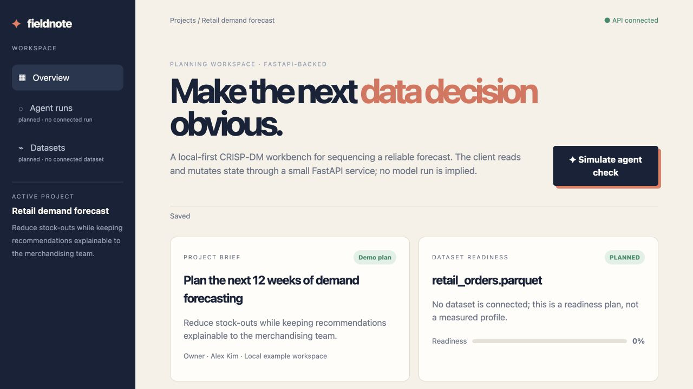
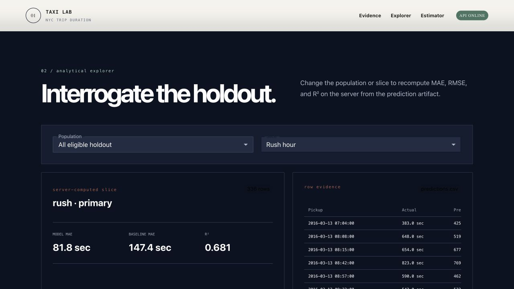
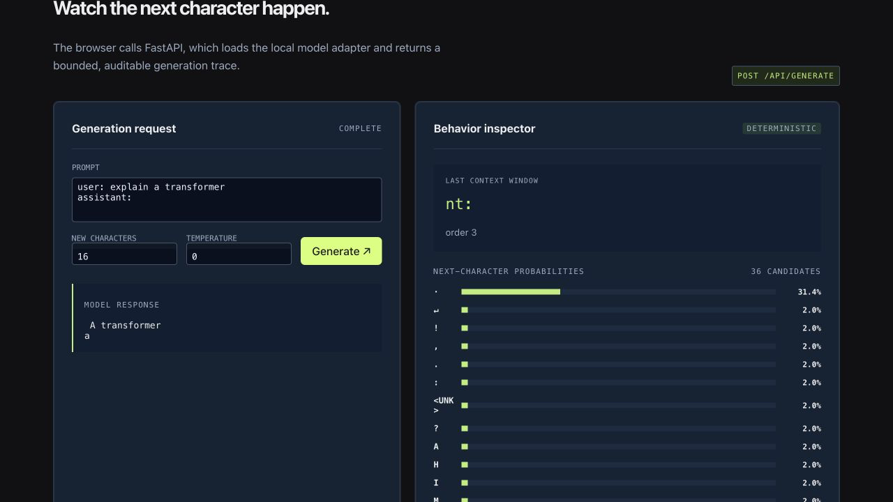
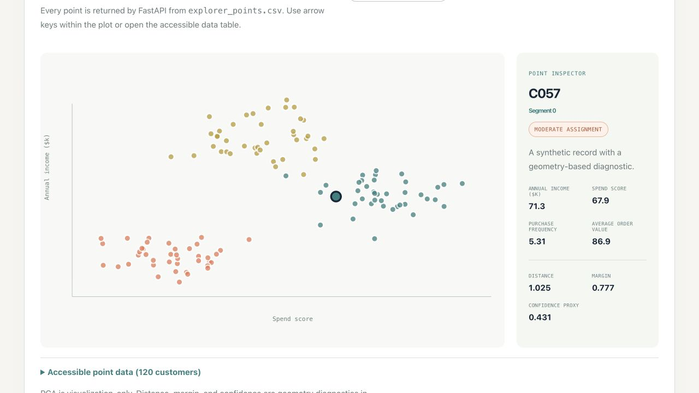
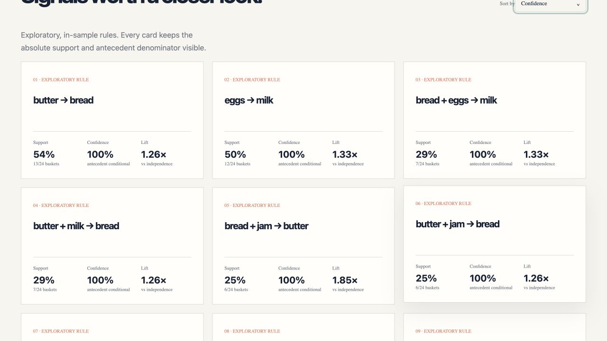
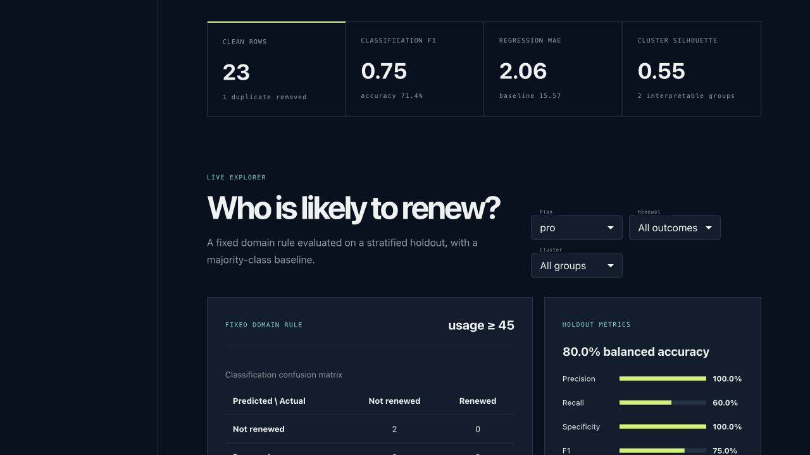

# Demo Scripts: Projects 00–05

These notes are designed as short, evidence-first talking tracks for the six local React/FastAPI demos. Each screenshot was captured after exercising the control named below.

## Project 00 — Dynamic Data-Science Todo Workspace

- **Purpose:** Organize a data-science project as an explicit CRISP-DM workflow before claiming that data or model results exist.
- **Data-science concept:** Problem framing, data-readiness checks, and traceable progression through business understanding, data understanding, preparation, modeling, evaluation, and deployment.
- **What the screenshot shows:** The API-connected planning workspace, retail-demand project brief, dataset-readiness state, and the saved result of the **Simulate agent check** action.
- **Suggested talking point:** “A sound DS project starts with an auditable question and readiness criteria. This project deliberately distinguishes planned work from measured evidence so the UI cannot imply that an unrun model produced results.”
- **Demo move:** Click **Simulate agent check**, then point out the saved status, the 0% readiness state, and the wording that no model run is implied.

## Project 01 — NYC Taxi Trip-Duration Prediction

- **Purpose:** Predict taxi trip duration while exposing the experiment boundary, baseline, holdout errors, and individual prediction evidence.
- **Data-science concept:** Supervised regression with engineered distance/time features, a strict chronological train/holdout split, regularization, and evaluation against a median baseline using MAE and R².
- **What the screenshot shows:** The server-computed **Rush hour** holdout slice: 336 rows, model MAE of 81.8 seconds, baseline MAE of 147.4 seconds, R² of 0.681, and row-level predictions.
- **Suggested talking point:** “The split is chronological because a random split could leak future traffic patterns. On this rush-hour slice, the model beats the baseline by about 66 seconds of MAE, while R² summarizes the variance explained.”
- **Demo move:** Change **Slice** from **All rows** to **Rush hour** and explain that the API recomputes the metrics from the checked-in prediction artifact rather than filtering mock browser values.

## Project 02 — Nano LLM / Character Language Model

- **Purpose:** Make next-character language modeling small enough to inspect from data split through generation.
- **Data-science concept:** Causal sequence modeling with a training-only vocabulary, chronological train/validation/test suffixes, smoothed character n-grams, test loss/perplexity, and normalized next-character probabilities.
- **What the screenshot shows:** A completed deterministic API generation, its final context window, the generated continuation, and the probability distribution over 36 candidate characters.
- **Suggested talking point:** “Perplexity measures how surprised the model is by held-out characters; lower is better. The chronological split and causal context ensure the model only uses earlier characters to predict the next one.”
- **Demo move:** Keep temperature at 0, click **Generate**, and trace the prompt → context window → probability distribution → selected character path.

## Project 03 — Customer Segmentation with K-Means

- **Purpose:** Discover and inspect customer groups without pretending that the unsupervised clusters are known business personas.
- **Data-science concept:** Standardized K-Means clustering, candidate-k comparison, silhouette score for separation/cohesion, repeated-partition Adjusted Rand Index for stability, and point-to-centroid geometry diagnostics.
- **What the screenshot shows:** Three visible customer clusters and selected customer **C057**, whose margin of 0.777 and confidence proxy of 0.431 mark a moderate—not certain—assignment.
- **Suggested talking point:** “Silhouette and ARI evaluate geometric quality and stability, not campaign lift. C057 is useful because its smaller nearest-versus-second-nearest centroid margin demonstrates that cluster assignments have different levels of geometric ambiguity.”
- **Demo move:** Select **C057** in the scatter plot and compare its distance, margin, and confidence proxy with a clearly assigned point.

## Project 04 — Associative Pattern Mining

- **Purpose:** Find frequently co-occurring products and qualify directional basket rules with visible denominators.
- **Data-science concept:** Apriori frequent-itemset mining and association-rule evaluation using support, confidence, and lift. Support controls prevalence, confidence estimates the conditional rate, and lift compares that rate with the consequent’s base rate.
- **What the screenshot shows:** The completed association-rule board after changing **Sort by** to **Confidence**, with rule cards that retain support counts, antecedent counts, confidence, and lift.
- **Suggested talking point:** “A high-confidence rule can be misleading when the consequent is already common, so I use lift to normalize confidence by the consequent’s support and retain absolute basket counts for context.”
- **Demo move:** Adjust minimum support or confidence, then compare ranking by **Lift** and **Confidence** while keeping the absolute basket denominators visible.

## Project 05 — Data Science Skills Lab

- **Purpose:** Put cleaning, classification, regression, and clustering protocols side by side on one reproducible synthetic fixture.
- **Data-science concept:** Train-only imputation, explicit baselines, stratified classification evaluation, continuous-target regression evaluation, and standardized unsupervised clustering.
- **What the screenshot shows:** The classification module filtered to **pro** plan rows, with a fixed `usage ≥ 45` rule, a confusion matrix, and holdout metrics including 80% balanced accuracy and 0.75 F1.
- **Suggested talking point:** “Balanced accuracy matters when classes are uneven because it averages sensitivity across classes. The global row filter changes the evidence table but intentionally does not recompute subgroup model metrics, preventing a filtered view from being mistaken for a new evaluation.”
- **Demo move:** Open **02 · Classification**, filter **Plan** to **pro**, and distinguish the fixed holdout metrics from the server-filtered row evidence.
